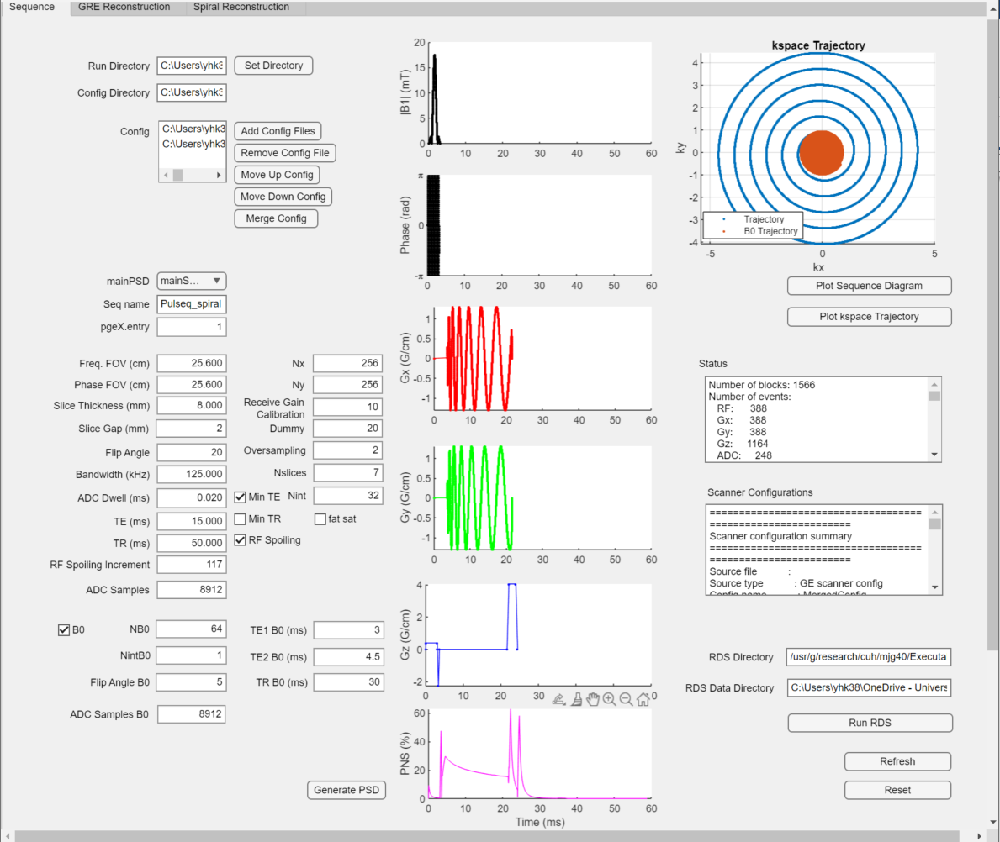
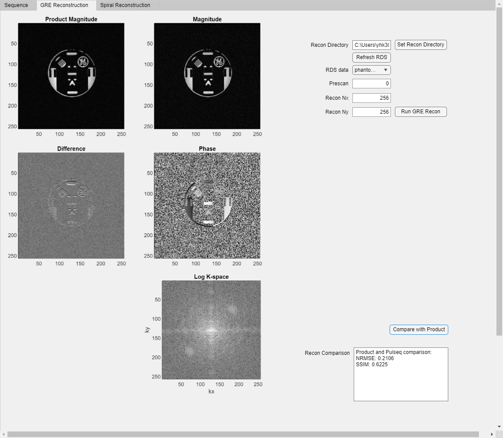
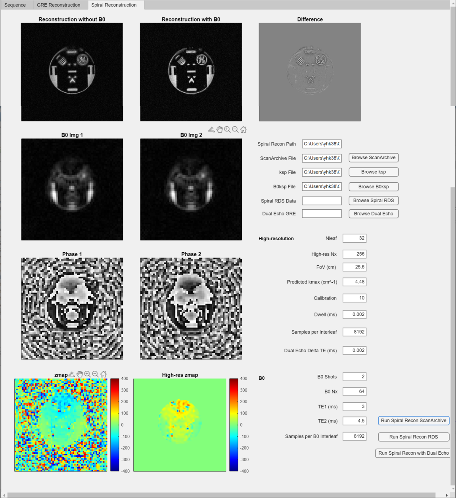

# Graphical User Interface for Pulseq Sequence Programming on GE HealthCare MRI Systems

This repository contains code and files developed for the implementation of Pulseq sequences on GE HealthCare MRI systems. The GUI was part of a Medical Science (Radiology) research project at the University of Cambridge.

## Overview

This repository includes code for:
- Pulseq gradient-recalled echo (GRE) and spiral sequence generation
- GRE and spiral image reconstruction 
- B0 field map estimation and correction
- MATLAB-based GUI for sequence generation and image reconstruction

## Repository Structure

- main/ - Main MATLAB scripts to facilitate Pulseq sequence generation workflow
- write/ - MATLAB scripts for Pulseq sequence generation
- utils/ - Functions used during sequence generation
- recon/ - Functions for image reconstruction
- scanner_sim_ge.mlapp - MATLAB GUI app for sequence generation and image reconstruction
- gui_manual.txt - GUI manual detailing the usage of the interface

## Requirements

- MATLAB
- Pulseq (https://github.com/pulseq/pulseq)
- Pulseg (https://github.com/HarmonizedMRI/pulseg)
- TOPPE (https://github.com/toppemri/toppe)
- MIRT (https://github.com/JeffFessler/MIRT)
- GE HealthCare EPIC (proprietary)

## GUI

The GUI includes three panels, the sequence generation panel, the GRE image reconstruction panel, and the spiral image reconstruction panel. 

*Figure 1. Sequence generation panel.*

*Figure 2. GRE reconstruction panel.*

*Figure 3. Spiral reconstruction panel.*

## Acknowledgements

This project is based on and adapts code from the official Pulseq on GE v2 repository (https://github.com/HarmonizedMRI/SequenceExamples-GE/tree/main).

